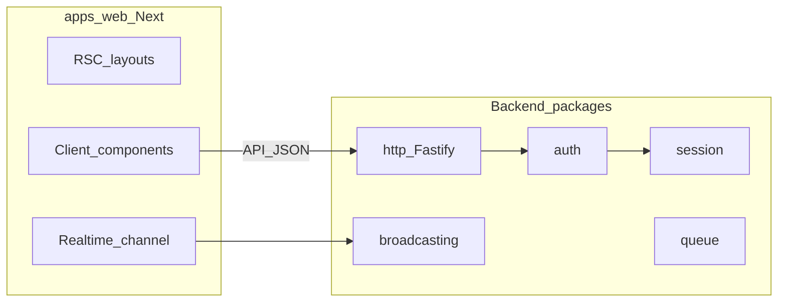

# Backlog Madda — paridade mental com Laravel + front tipo Next.js

**Objetivo:** definir a ordem mais lógica para introduzir pacotes e apps em falta, alinhados ao ecossistema Laravel, mantendo no frontend uma experiência próxima do Next.js (React, navegação em cliente sem reload completo da página, dados e tempo real bem integrados).

---

## Já temos (não duplicar)

| Área | Pacotes |
|------|---------|
| HTTP servidor | [`packages/http`](packages/http/package.json) — Fastify |
| Núcleo app | [`packages/core`](packages/core/package.json), [`packages/container`](packages/container/package.json), [`packages/config`](packages/config/package.json) |
| Dados | [`packages/database`](packages/database/package.json), [`packages/pagination`](packages/pagination/package.json), [`packages/collection`](packages/collection/package.json) |
| Segurança | [`packages/hashing`](packages/hashing/package.json), [`packages/encryption`](packages/encryption/package.json) |
| Utilitários | [`packages/validation`](packages/validation/package.json), [`packages/pipeline`](packages/pipeline/package.json), [`packages/log`](packages/log/package.json), [`packages/console`](packages/console/package.json), [`packages/support`](packages/support/package.json), [`packages/reflection`](packages/reflection/package.json), [`packages/events`](packages/events/package.json), [`packages/bus`](packages/bus/package.json), [`packages/process`](packages/process/package.json), [`packages/filesystem`](packages/filesystem/package.json), [`packages/redis`](packages/redis/package.json), [`packages/cache`](packages/cache/package.json) |
| Cookie / sessão | [`packages/cookie`](packages/cookie/package.json) (`parseCookieHeader`, `serializeSetCookie`, assinatura HMAC, encriptação via [`Encrypter`](packages/encryption)), [`packages/session`](packages/session/package.json) (`SessionStore`, ficheiro/Redis, [`createSessionMiddleware`](packages/session/src/middleware.ts), config em [`SessionConfigShape`](packages/config/src/types/session-config.ts)) |

O [`apps/playground`](apps/playground/package.json) é hoje **Node + tsx** (sem Next). Para “parecido com Next.js no front”, prevê-se um **`apps/web`** (Next.js App Router) como marco explícito na secção [Frontend](#frontend-nextjs--react-sem-reload-completo).

**Pontos de integração a lembrar no trabalho futuro**

- **`@madda/http`:** cookies, sessão, auth e broadcasting ligam-se aqui (middlewares Fastify, hooks).
- **`@madda/validation`:** regras de input atuais; **jsonschema** deve complementar (schemas exportáveis / OpenAPI) ou fundir — ver [Fase 12](#fase-12-jsonschema).

---

## Pacotes em falta (lista de trabalho)

auth · broadcasting · http _(expandir)_ · jsonschema · mail · notifications · queue · testing · translation · view

_(Fases 1–4: support, reflection, events+bus, process+filesystem. Fase 5: [`@madda/redis`](packages/redis/package.json), [`@madda/cache`](packages/cache/package.json) — **cache default = ficheiro**. Fase 6: [`@madda/cookie`](packages/cookie/package.json), [`@madda/session`](packages/session/package.json).)_

---

## Fases e tarefas

### Fase 1 — Padrões transversais (macroable, conditionable)

Em TypeScript não há traits PHP; o equivalente é mixin com `Object.assign`, classe base, ou extensão pontual de instâncias.

- [x] **Decisão:** ficar em [`@madda/support`](packages/support/package.json) (`conditionable.ts`, `macroable.ts`) — sem pacote `@madda/macroable` até haver reutilização noutro workspace sem depender de support.
- [x] **conditionable:** `whenInstance` / `unlessInstance` + métodos `when` / `unless` em [`Stringable`](packages/support/src/stringable.ts) e [`Fluent`](packages/support/src/fluent.ts).
- [x] **macroable:** `registerMacro`, `hasMacro`, `flushMacros` + `Stringable.macro` / `Fluent.macro` (falha se o nome colidir com membros existentes).
- [x] **Onde aplicar a seguir:** wrappers HTTP (request/response/builder) quando existirem em `@madda/http`; reutilizar `whenInstance` / `registerMacro` a partir de `@madda/support`.

**Dependências:** nenhuma crítica.

---

### Fase 2 — Reflection + container

- [x] Pacote [`@madda/reflection`](packages/reflection/package.json): bootstrap `reflect-metadata`, chaves `DESIGN_*`, helpers `getDesignParamTypes` / `getDesignParamTypesForMethod`, símbolos HTTP partilhados (`HTTP_*_METADATA`), subpath `@madda/reflection/register`.
- [x] [`packages/container`](packages/container): `alias(from, to)` (delegação de resolução); DI continua a usar `getDesignParamTypes` + `INJECT_METADATA_KEY` / `@Inject`.
- [x] [`packages/http`](packages/http) importa `@madda/reflection` (metadados unificados); [`registerController`](packages/http/src/register-controller.ts) aceita `options.container` para instanciar o controller via `ContainerResolutionContract.get`.

**Metadados bus:** [`BUS_HANDLES_COMMAND_METADATA`](packages/reflection/src/bus-metadata.ts) em `@madda/reflection` (usado pelo decorator `@Handles` em `@madda/bus`).

**Dependências:** [`packages/container`](packages/container), [`packages/http`](packages/http) (consumidor).

---

### Fase 3 — Events e Bus (síncrono)

- [x] **`@madda/events`:** [`Dispatcher`](packages/events/src/dispatcher.ts) (`listen`, `forget`, `emit` síncrono por string ou por `constructor` do evento), classe base [`Event`](packages/events/src/event.ts), [`discoverEventListeners`](packages/events/src/discover.ts) com imports opt-in.
- [x] **`@madda/bus`:** [`CommandBus`](packages/bus/src/command-bus.ts) (`register`, `registerHandler` + `@Handles`, `dispatch` síncrono, `dispatchAsync` com [`@madda/pipeline`](packages/pipeline)), tipo [`QueryBus`](packages/bus/src/command-bus.ts) como alias.

**Dependências:** Fase 2. Integra com [`packages/container`](packages/container).

---

### Fase 4 — Process e Filesystem

- [x] **`@madda/process`:** [`runProcess`](packages/process/src/run.ts), [`ProcessResult`](packages/process/src/process-result.ts) (`successful`, `output`, `errorOutput`), timeout / stdin / `throwOnFailure`, [`pendingProcess()`](packages/process/src/pending-process.ts) (fluent).
- [x] **`@madda/filesystem`:** [`FilesystemContract`](packages/filesystem/src/filesystem-contract.ts), [`LocalFilesystem`](packages/filesystem/src/local-filesystem.ts), [`localDisk`](packages/filesystem/src/factory.ts), [`FilesystemManager`](packages/filesystem/src/filesystem-manager.ts), paths confinados à raiz ([`resolveInsideRoot`](packages/filesystem/src/path-guard.ts)).

**Dependências:** mínimas; útil para jobs e ferramentas CLI ([`packages/console`](packages/console)).

---

### Fase 5 — Redis e Cache

- [x] **`@madda/redis`:** [`RedisConnectionContract`](packages/redis/src/redis-connection-contract.ts), [`IoRedisAdapter`](packages/redis/src/ioredis-adapter.ts) + [`createIoRedis`](packages/redis/src/factory.ts) / [`redisConnectionFromConfig`](packages/redis/src/factory.ts) (chaves `redis.default`, `redis.connections`), [`redisHealthCheck`](packages/redis/src/health.ts).
- [x] **`@madda/cache`:** [`CacheRepository`](packages/cache/src/cache-repository.ts), lojas [`FileCacheStore`](packages/cache/src/stores/file-cache-store.ts) (**default** via [`createCacheManagerFromConfig`](packages/cache/src/factory.ts) + `cache.default` = `file`), [`ArrayCacheStore`](packages/cache/src/stores/array-cache-store.ts), [`RedisCacheStore`](packages/cache/src/stores/redis-cache-store.ts); TTL; [`flushPrefix`](packages/cache/src/cache-repository.ts); tipos [`CacheConfigShape`](packages/config/src/types/cache-config.ts) / [`RedisConfigShape`](packages/config/src/types/redis-config.ts) em [`@madda/config`](packages/config).

**Dependências:** Fase 5 antes de sessão/queue com Redis. Cache em disco usa [`Fase 4`](packages/filesystem) opcionalmente na app (o driver `file` do cache usa `fs` direto).

---

### Fase 6 — Cookie e Session

- [x] **`@madda/cookie`:** [`parseCookieHeader`](packages/cookie/src/parse.ts), [`serializeSetCookie`](packages/cookie/src/set-cookie.ts) (HttpOnly, Secure, SameSite, Path, Domain, Max-Age, Expires); [`signCookieValue`](packages/cookie/src/sign.ts) / [`unsignCookieValue`](packages/cookie/src/sign.ts); [`encryptCookieValue`](packages/cookie/src/encrypt.ts) / [`decryptCookieValue`](packages/cookie/src/encrypt.ts) com [`Encrypter`](packages/encryption).
- [x] **`@madda/session`:** contrato [`SessionStore`](packages/session/src/session-store-contract.ts), [`FileSessionStore`](packages/session/src/file-session-store.ts), [`RedisSessionStore`](packages/session/src/redis-session-store.ts); [`createSessionMiddleware`](packages/session/src/middleware.ts) (`HttpMiddleware` + `HttpContext.state` + `reply.appendCookieLine`); [`createSessionMiddlewareFromConfig`](packages/session/src/factory.ts) / [`createSessionStoreFromConfig`](packages/session/src/factory.ts); [`Session`](packages/session/src/session.ts) com `regenerate()` e `flash()` (uma leitura no pedido seguinte via `__flash_pending`); [`HttpRequest.headers`](packages/http/src/http-message-contract.ts) / [`HttpReply.appendCookieLine`](packages/http/src/http-message-contract.ts) no driver Fastify.

**Dependências:** [`packages/http`](packages/http), [`packages/encryption`](packages/encryption). Fase 5 se store Redis. *(Store `database` fica para evolução / paridade total com Laravel.)*

---

### Fase 7 — Queue

- [ ] **`@madda/queue`:** contrato de job, serializer, driver `sync` primeiro.
- [ ] Drivers `redis` / `database` (tabela de jobs) depois do núcleo estável.
- [ ] Alinhar com **events** (disparar job a partir de listener) e com **notifications** mais tarde.

**Dependências:** Fase 3, Fase 5 (redis), [`packages/database`](packages/database) (driver DB).

---

### Fase 8 — Mail e Notifications

- [ ] **`@madda/mail`:** transportes `log` + SMTP; mensagem mínima (from, to, subject, html/text); templates simples.
- [ ] **`@madda/notifications`:** canais `mail`, `database` (persistir na BD); interface para canal **broadcasting** (gancho apenas até Fase 9 existir).

**Dependências:** Fase 3 (events úteis), Fase 7 opcional para envio assíncrono, [`packages/database`](packages/database) para canal database.

---

### Fase 9 — Broadcasting

- [ ] **`@madda/broadcasting`:** contratos de canal/evento; driver **SSE** e/ou **WebSocket**; presença simplificada se necessário.
- [ ] Documentar contrato HTTP em [`packages/http`](packages/http) para subscrição e entrega.
- [ ] Ligar ao frontend: ver [Frontend — tempo real](#frontend-nextjs--react-sem-reload-completo).

**Dependências:** Fase 3; Fase 6 opcional para auth de canais.

---

### Fase 10 — Auth

- [ ] **`@madda/auth`:** guards; sessão web + tokens API (mentalidade Sanctum); integração [`packages/hashing`](packages/hashing), encryption, session, cookie.
- [ ] Middlewares Fastify: utilizador opcional/obrigatório; políticas (autorização) podem reutilizar [`packages/validation`](packages/validation) para entrada e regras de negócio à parte.

**Dependências:** Fase 6 (forte), Fase 5 (opcional), [`packages/database`](packages/database) se utilizadores em BD.

---

### Fase 11 — Translation e View

- [ ] **`@madda/translation`:** ficheiros de locale, fallback, `trans()` no servidor; exportar chaves ou pacotes para o **Next** (mesmo namespace no client).
- [ ] **`@madda/view`:** decidir escopo: motor de templates no servidor (ex.: JSX/HTML mínimo) **vs** posição “API + RSC”: maior parte UI no `apps/web`, views só para e-mail ou páginas legadas.

**Dependências:** [`packages/config`](packages/config) para locale default; Fase 8 para e-mails templated.

---

### Fase 12 — JSON Schema

- [ ] **`@madda/jsonschema`:** validação contra JSON Schema / exportação OpenAPI; validação de request/response em [`packages/http`](packages/http).
- [ ] **Decisão explícita:** complementar [`packages/validation`](packages/validation) (recomendado: validação atual para DX interna, schema para contrato público) **ou** evoluir um único pacote — registar a decisão aqui quando feita.

**Dependências:** [`packages/validation`](packages/validation), [`packages/http`](packages/http).

---

### Fase 13 — Testing

- [ ] **`@madda/testing`:** fakes para mail, queue, events, cache; helpers para levantar app Fastify de teste; utilitários de asserção assíncrona.
- [ ] Documentar estratégia e2e futura (Playwright contra `apps/web` + API).

**Dependências:** quanto mais pacotes existirem, mais fakes fazem sentido; pode começar cedo com subset.

---

## Frontend (Next.js / React, sem reload completo)

Tarefas de produto, não substituem os pacotes acima mas **consomem-nos**.

- [ ] Criar **`apps/web`** com Next.js (App Router), layouts partilhados e `next/link` para navegação em cliente (sem reload completo).
- [ ] Contrato com a API Fastify: tipos partilhados (ex.: `packages/contracts`) ou OpenAPI gerado a partir de rotas/schemas.
- [ ] **Auth no browser:** cookies `httpOnly` + fluxo de sessão ou refresh; nunca expor segredos em `localStorage` por defeito.
- [ ] **Dados:** RSC onde fizer sentido; para atualizações parciais no client, fetch + estado (ex.: TanStack Query) — escolha documentada no repo.
- [ ] **Tempo real:** cliente React subscreve via `EventSource` ou WebSocket alinhado a `@madda/broadcasting`, atualizando só o estado necessário (sem recarregar a página).

---

## HTTP (`@madda/http`) — nota

O pacote já existe; as fases 6–10 e 12 acrescentam **middlewares, extensões e documentação** em torno dele, não um segundo pacote “http”. Tarefas transversais:

- [ ] Documentar padrão de registo de plugins (cookie, session, auth, broadcasting).
- [ ] Opcional: cliente HTTP saída (Laravel `Http` facade) como submódulo ou pacote `@madda/http-client` se quiseres simetria com Guzzle.

---

## Fora de escopo imediato

Para manter o backlog focado: Horizon, Vapor, Scout, Echo (cliente Laravel oficial), Dusk, Pint, Socialite, Passport completo, Octane, Telescope, Filament, etc. Podem entrar como secções futuras quando o núcleo acima estiver estável.

---

## Como usar este ficheiro

1. Implementar fases na ordem quando possível; quando uma fase estiver bloqueada por dependência, saltar só o mínimo necessário.
2. Marcar checkboxes `- [ ]` → `- [x]` no próprio `BACKLOG.md` à medida que as tarefas fecham (ou referenciar PRs/issues ao lado).
