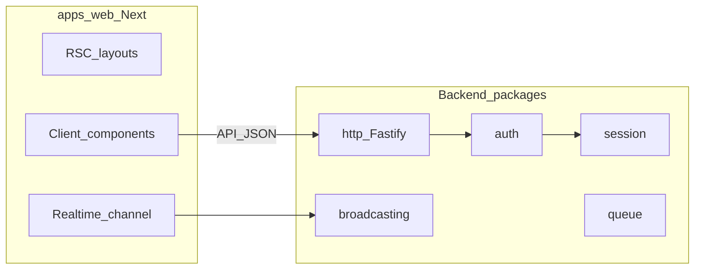

# Backlog Madda — paridade mental com Laravel + front tipo Next.js

**Objetivo:** definir a ordem mais lógica para introduzir pacotes e apps em falta, alinhados ao ecossistema Laravel, mantendo no frontend uma experiência próxima do Next.js (React, navegação em cliente sem reload completo da página, dados e tempo real bem integrados).

---

## Já temos (não duplicar)

| Área | Pacotes |
|------|---------|
| HTTP servidor | [`packages/http`](packages/http/package.json) — Fastify |
| Núcleo app | [`packages/core`](packages/core/package.json), [`packages/container`](packages/container/package.json), [`packages/config`](packages/config/package.json) |
| Dados | [`packages/database`](packages/database/package.json), [`packages/pagination`](packages/pagination/package.json), [`packages/collection`](packages/collection/package.json) |
| Segurança | [`packages/hashing`](packages/hashing/package.json), [`packages/encryption`](packages/encryption/package.json) |
| Utilitários | [`packages/validation`](packages/validation/package.json), [`packages/pipeline`](packages/pipeline/package.json), [`packages/log`](packages/log/package.json), [`packages/console`](packages/console/package.json), [`packages/support`](packages/support/package.json) |

O [`apps/playground`](apps/playground/package.json) é hoje **Node + tsx** (sem Next). Para “parecido com Next.js no front”, prevê-se um **`apps/web`** (Next.js App Router) como marco explícito na secção [Frontend](#frontend-nextjs--react-sem-reload-completo).

**Pontos de integração a lembrar no trabalho futuro**

- **`@madda/http`:** cookies, sessão, auth e broadcasting ligam-se aqui (middlewares Fastify, hooks).
- **`@madda/validation`:** regras de input atuais; **jsonschema** deve complementar (schemas exportáveis / OpenAPI) ou fundir — ver [Fase 12](#fase-12-jsonschema).

---

## Pacotes em falta (lista de trabalho)

auth · broadcasting · bus · cache · conditionable · cookie · events · filesystem · http _(expandir)_ · jsonschema · macroable · mail · notifications · process · queue · redis · reflection · session · testing · translation · view

---

## Fases e tarefas

### Fase 1 — Padrões transversais (macroable, conditionable)

Em TypeScript não há traits PHP; o equivalente é mixin com `Object.assign`, classe base, ou extensão pontual de instâncias.

- [ ] Decidir: pacote mínimo `@madda/macroable` vs convenções apenas em `@madda/support`.
- [ ] **conditionable:** API tipo `when` / `unless` em tipos alvo (ex.: builders, `Stringable`) sem magia global.
- [ ] **macroable:** registo de métodos em runtime com tipagem o mais segura possível (generics + mapa de nomes).
- [ ] Documentar onde aplicar primeiro (ex.: `Stringable`, wrappers de request/response quando existirem).

**Dependências:** nenhuma crítica.

---

### Fase 2 — Reflection + container

- [ ] Pacote ou módulo `@madda/reflection`: metadados para DI alinhados a `reflect-metadata` (já usado em `@madda/http`).
- [ ] Revisar [`packages/container`](packages/container): registo por token, ciclo de vida, resolução de construtor.
- [ ] Garantir que decorators / metadata usados em HTTP e futuros commands encaixam no mesmo modelo.

**Dependências:** [`packages/container`](packages/container), [`packages/http`](packages/http) (consumidor).

---

### Fase 3 — Events e Bus (síncrono)

- [ ] **`@madda/events`:** dispatcher, contrato de `Event`, registo de listeners, `emit` síncrono; descoberta opcional (ficheiros).
- [ ] **`@madda/bus`:** commands/queries síncronos; handlers resolvidos pelo container; opcional pipeline com [`@madda/pipeline`](packages/pipeline).

**Dependências:** Fase 2. Integra com [`packages/container`](packages/container).

---

### Fase 4 — Process e Filesystem

- [ ] **`@madda/process`:** wrapper tipado sobre `child_process` (timeout, stdout/stderr, código de saída, API estilo “result”).
- [ ] **`@madda/filesystem`:** disco local, API tipo Laravel `Storage` (exists, get, put, delete); contratos para S3/cloud numa fase posterior.

**Dependências:** mínimas; útil para jobs e ferramentas CLI ([`packages/console`](packages/console)).

---

### Fase 5 — Redis e Cache

- [ ] **`@madda/redis`:** contrato + implementação (ex.: `ioredis` ou `node-redis`), healthcheck, config via [`packages/config`](packages/config).
- [ ] **`@madda/cache`:** drivers `memory` + `redis`; TTL; opcional tags/flush por prefixo; integração com config cache.

**Dependências:** Fase 5a antes de sessão/queue avançados. Opcional: Fase 4 para cache em ficheiro.

---

### Fase 6 — Cookie e Session

- [ ] **`@madda/cookie`:** parse de `Cookie`, construção de `Set-Cookie`, atributos (HttpOnly, Secure, SameSite); assinatura/encriptação com [`packages/encryption`](packages/encryption).
- [ ] **`@madda/session`:** abstração de store (file → redis/database); middleware Fastify em [`packages/http`](packages/http); regeneração de ID; flash opcional.

**Dependências:** [`packages/http`](packages/http), [`packages/encryption`](packages/encryption). Fase 5 se store Redis.

---

### Fase 7 — Queue

- [ ] **`@madda/queue`:** contrato de job, serializer, driver `sync` primeiro.
- [ ] Drivers `redis` / `database` (tabela de jobs) depois do núcleo estável.
- [ ] Alinhar com **events** (disparar job a partir de listener) e com **notifications** mais tarde.

**Dependências:** Fase 3, Fase 5 (redis), [`packages/database`](packages/database) (driver DB).

---

### Fase 8 — Mail e Notifications

- [ ] **`@madda/mail`:** transportes `log` + SMTP; mensagem mínima (from, to, subject, html/text); templates simples.
- [ ] **`@madda/notifications`:** canais `mail`, `database` (persistir na BD); interface para canal **broadcasting** (gancho apenas até Fase 9 existir).

**Dependências:** Fase 3 (events úteis), Fase 7 opcional para envio assíncrono, [`packages/database`](packages/database) para canal database.

---

### Fase 9 — Broadcasting

- [ ] **`@madda/broadcasting`:** contratos de canal/evento; driver **SSE** e/ou **WebSocket**; presença simplificada se necessário.
- [ ] Documentar contrato HTTP em [`packages/http`](packages/http) para subscrição e entrega.
- [ ] Ligar ao frontend: ver [Frontend — tempo real](#frontend-nextjs--react-sem-reload-completo).

**Dependências:** Fase 3; Fase 6 opcional para auth de canais.

---

### Fase 10 — Auth

- [ ] **`@madda/auth`:** guards; sessão web + tokens API (mentalidade Sanctum); integração [`packages/hashing`](packages/hashing), encryption, session, cookie.
- [ ] Middlewares Fastify: utilizador opcional/obrigatório; políticas (autorização) podem reutilizar [`packages/validation`](packages/validation) para entrada e regras de negócio à parte.

**Dependências:** Fase 6 (forte), Fase 5 (opcional), [`packages/database`](packages/database) se utilizadores em BD.

---

### Fase 11 — Translation e View

- [ ] **`@madda/translation`:** ficheiros de locale, fallback, `trans()` no servidor; exportar chaves ou pacotes para o **Next** (mesmo namespace no client).
- [ ] **`@madda/view`:** decidir escopo: motor de templates no servidor (ex.: JSX/HTML mínimo) **vs** posição “API + RSC”: maior parte UI no `apps/web`, views só para e-mail ou páginas legadas.

**Dependências:** [`packages/config`](packages/config) para locale default; Fase 8 para e-mails templated.

---

### Fase 12 — JSON Schema

- [ ] **`@madda/jsonschema`:** validação contra JSON Schema / exportação OpenAPI; validação de request/response em [`packages/http`](packages/http).
- [ ] **Decisão explícita:** complementar [`packages/validation`](packages/validation) (recomendado: validação atual para DX interna, schema para contrato público) **ou** evoluir um único pacote — registar a decisão aqui quando feita.

**Dependências:** [`packages/validation`](packages/validation), [`packages/http`](packages/http).

---

### Fase 13 — Testing

- [ ] **`@madda/testing`:** fakes para mail, queue, events, cache; helpers para levantar app Fastify de teste; utilitários de asserção assíncrona.
- [ ] Documentar estratégia e2e futura (Playwright contra `apps/web` + API).

**Dependências:** quanto mais pacotes existirem, mais fakes fazem sentido; pode começar cedo com subset.

---

## Frontend (Next.js / React, sem reload completo)

Tarefas de produto, não substituem os pacotes acima mas **consomem-nos**.

- [ ] Criar **`apps/web`** com Next.js (App Router), layouts partilhados e `next/link` para navegação em cliente (sem reload completo).
- [ ] Contrato com a API Fastify: tipos partilhados (ex.: `packages/contracts`) ou OpenAPI gerado a partir de rotas/schemas.
- [ ] **Auth no browser:** cookies `httpOnly` + fluxo de sessão ou refresh; nunca expor segredos em `localStorage` por defeito.
- [ ] **Dados:** RSC onde fizer sentido; para atualizações parciais no client, fetch + estado (ex.: TanStack Query) — escolha documentada no repo.
- [ ] **Tempo real:** cliente React subscreve via `EventSource` ou WebSocket alinhado a `@madda/broadcasting`, atualizando só o estado necessário (sem recarregar a página).

---

## HTTP (`@madda/http`) — nota

O pacote já existe; as fases 6–10 e 12 acrescentam **middlewares, extensões e documentação** em torno dele, não um segundo pacote “http”. Tarefas transversais:

- [ ] Documentar padrão de registo de plugins (cookie, session, auth, broadcasting).
- [ ] Opcional: cliente HTTP saída (Laravel `Http` facade) como submódulo ou pacote `@madda/http-client` se quiseres simetria com Guzzle.

---

## Fora de escopo imediato

Para manter o backlog focado: Horizon, Vapor, Scout, Echo (cliente Laravel oficial), Dusk, Pint, Socialite, Passport completo, Octane, Telescope, Filament, etc. Podem entrar como secções futuras quando o núcleo acima estiver estável.

---

## Como usar este ficheiro

1. Implementar fases na ordem quando possível; quando uma fase estiver bloqueada por dependência, saltar só o mínimo necessário.
2. Marcar checkboxes `- [ ]` → `- [x]` no próprio `BACKLOG.md` à medida que as tarefas fecham (ou referenciar PRs/issues ao lado).
