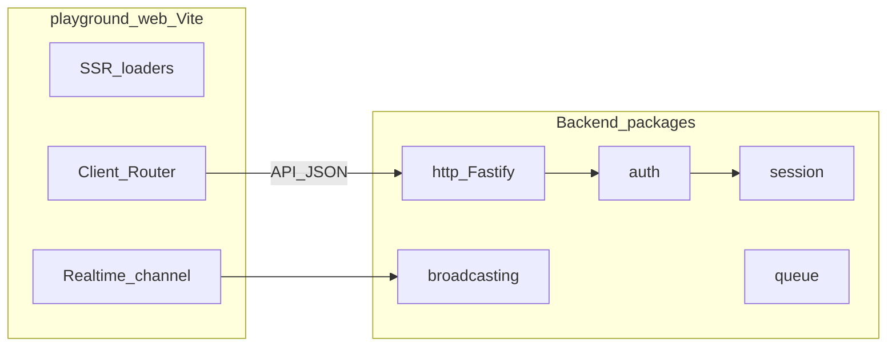

# Backlog Madda — paridade mental com Laravel + front tipo Next.js

**Objetivo:** definir a ordem mais lógica para introduzir pacotes e apps em falta, alinhados ao ecossistema Laravel, mantendo no frontend uma experiência próxima do Next.js (React, navegação em cliente sem reload completo da página, dados e tempo real bem integrados).

---

## Já temos (não duplicar)

| Área | Pacotes |
|------|---------|
| HTTP servidor | [`packages/http`](packages/http/package.json) — Fastify |
| Núcleo app | [`packages/core`](packages/core/package.json), [`packages/container`](packages/container/package.json), [`packages/config`](packages/config/package.json) |
| Dados | [`packages/database`](packages/database/package.json), [`packages/pagination`](packages/pagination/package.json), [`packages/collection`](packages/collection/package.json) |
| Segurança | [`packages/hashing`](packages/hashing/package.json), [`packages/encryption`](packages/encryption/package.json), [`packages/auth`](packages/auth/package.json) ([`createAuthMiddleware`](packages/auth/src/create-auth-middleware.ts), [`Gate`](packages/auth/src/gate.ts), tokens API [`MemoryApiTokenStore`](packages/auth/src/memory-api-token-store.ts); tipos [`AuthConfigShape`](packages/config/src/types/auth-config.ts)) |
| Utilitários | [`packages/validation`](packages/validation/package.json), [`packages/pipeline`](packages/pipeline/package.json), [`packages/log`](packages/log/package.json), [`packages/console`](packages/console/package.json), [`packages/support`](packages/support/package.json), [`packages/reflection`](packages/reflection/package.json), [`packages/events`](packages/events/package.json), [`packages/bus`](packages/bus/package.json), [`packages/process`](packages/process/package.json), [`packages/filesystem`](packages/filesystem/package.json), [`packages/redis`](packages/redis/package.json), [`packages/cache`](packages/cache/package.json) |
| Cookie / sessão | [`packages/cookie`](packages/cookie/package.json) (`parseCookieHeader`, `serializeSetCookie`, assinatura HMAC, encriptação via [`Encrypter`](packages/encryption)), [`packages/session`](packages/session/package.json) (`SessionStore`, ficheiro/Redis, [`createSessionMiddleware`](packages/session/src/middleware.ts), config em [`SessionConfigShape`](packages/config/src/types/session-config.ts)) |
| Filas | [`packages/queue`](packages/queue/package.json) ([`JobSerializer`](packages/queue/src/job-serializer.ts), [`SyncQueueDriver`](packages/queue/src/sync-queue-driver.ts), [`RedisQueueDriver`](packages/queue/src/redis-queue-driver.ts), [`DatabaseQueueDriver`](packages/queue/src/database-queue-driver.ts), [`createQueueManagerFromConfig`](packages/queue/src/factory.ts), [`listenQueued`](packages/queue/src/listen-queued.ts); tipos [`QueueConfigShape`](packages/config/src/types/queue-config.ts)) |
| E-mail | [`packages/mail`](packages/mail/package.json) ([`MailManager`](packages/mail/src/mail-manager.ts), transportes `log` / `smtp` / [`Resend`](packages/mail/src/transports/resend-mail-transport.ts) / Mailtrap ([`SMTP`](packages/mail/src/transports/smtp-mail-transport.ts) sandbox·live + [`API`](packages/mail/src/transports/mailtrap-api-mail-transport.ts)), [`fillTemplate`](packages/mail/src/template.ts); tipos [`MailConfigShape`](packages/config/src/types/mail-config.ts)) |
| Notificações | [`packages/notifications`](packages/notifications/package.json) — [`Notification`](packages/notifications/src/notification.ts), [`NotificationSender`](packages/notifications/src/notification-sender.ts), canais `mail` / `database` / `broadcast` ([`createNotificationSenderFromConfig`](packages/notifications/src/factory.ts)); tipo [`NotificationConfigShape`](packages/config/src/types/notifications-config.ts) |
| Tempo real | [`packages/broadcasting`](packages/broadcasting/package.json) ([`LocalBroadcastHub`](packages/broadcasting/src/local-broadcast-hub.ts), SSE via [`createSseBroadcastRouteHandler`](packages/broadcasting/src/sse-route-handler.ts), WebSocket [`registerBroadcastWebSocketRoute`](packages/broadcasting/src/websocket-register.ts) com [`ws`](https://github.com/websockets/ws) + `upgrade` no servidor Node (sem `@fastify/websocket` nas rotas HTTP), [`MemoryPresenceStore`](packages/broadcasting/src/presence-memory.ts), [`registerBroadcastingRoutes`](packages/broadcasting/src/register-routes.ts); contrato HTTP em [`broadcasting-contract.ts`](packages/http/src/broadcasting-contract.ts); tipos [`BroadcastingConfigShape`](packages/config/src/types/broadcasting-config.ts)) |
| UI integrada (playground) | [`packages/play-web`](packages/play-web/package.json) — Vite + SSR React Router no Fastify ([`registerPlayWebDev`](packages/play-web/src/register-play-web-dev.ts)); páginas em [`apps/playground/web`](apps/playground/web) |
| Tradução | [`packages/translation`](packages/translation/package.json) — [`Translator`](packages/translation/src/translator.ts), [`loadLocaleMessages`](packages/translation/src/load-messages.ts), placeholders `:nome`; locale / fallback alinhados a [`app.locale`](packages/config/src/types/app-config.ts) (`APP_LOCALE`); tipo [`TranslationConfigShape`](packages/config/src/types/translation-config.ts) |
| View (texto / e-mail) | [`packages/view`](packages/view/package.json) — reexport [`fillTemplate`](packages/mail/src/template.ts) (`{{ chave }}`); UI principal em React, não motor JSX no servidor |
| JSON Schema / OpenAPI | [`packages/jsonschema`](packages/jsonschema/package.json) — AJV + `ajv-formats`, decorator [`RouteSchema`](packages/jsonschema/src/route-schema.ts), agregação OpenAPI 3.1 [`buildOpenApiDocument`](packages/jsonschema/src/collect-openapi.ts); integração em [`registerController`](packages/http/src/register-controller.ts) + [`JsonSchemaValidationError` → 400](packages/http/src/middleware/default-error-handler.ts) |
| Contratos API (tipos) | [`packages/contracts`](packages/contracts/package.json) — caminhos e tipos partilhados com o playground web |
| Cliente HTTP (saída) | [`packages/http-client`](packages/http-client/package.json) — `createHttpClient` sobre `fetch` |

O [`apps/playground`](apps/playground/package.json) é **Fastify + rotas Laravel-style** (`routes/web.ts`) e **UI React integrada** em [`apps/playground/web`](apps/playground/web) via [`@madda/play-web`](packages/play-web/package.json) (Vite + SSR, convénio tipo App Router, sem Next) — ver [Fase 11](#fase-11--frontend-play-web-react-no-playground).

**Pontos de integração a lembrar no trabalho futuro**

- **`@madda/http`:** cookies, sessão, auth e broadcasting ligam-se aqui (middlewares Fastify, hooks) — ver [`HTTP-PLUGINS.md`](packages/http/HTTP-PLUGINS.md).
- **`@madda/validation`:** regras de input (DX interna); **`@madda/jsonschema`:** contrato público + OpenAPI — ver [Fase 13](#fase-13-json-schema).

---

## Pacotes em falta (lista de trabalho)

http _(expandir, melhorias pontuais)_ · **testing** ([Fase 14](#fase-14--testing))

_(Fases 1–4: support, reflection, events+bus, process+filesystem. Fase 5: [`@madda/redis`](packages/redis/package.json), [`@madda/cache`](packages/cache/package.json) — **cache default = ficheiro**. Fase 6: [`@madda/cookie`](packages/cookie/package.json), [`@madda/session`](packages/session/package.json). Fase 7: [`@madda/queue`](packages/queue/package.json). Fase 8: [`@madda/mail`](packages/mail/package.json) + [`@madda/notifications`](packages/notifications/package.json). Fase 9: [`@madda/broadcasting`](packages/broadcasting/package.json). Fase 10: [`@madda/auth`](packages/auth/package.json). Fase 11: [`@madda/play-web`](packages/play-web/package.json) + [`apps/playground/web`](apps/playground/web). Fase 12: [`@madda/translation`](packages/translation/package.json), [`@madda/view`](packages/view/package.json) + [`lang/`](apps/playground/lang) no playground. Fase 13: [`@madda/jsonschema`](packages/jsonschema/package.json).)_

---

## Fases e tarefas

### Fase 1 — Padrões transversais (macroable, conditionable)

Em TypeScript não há traits PHP; o equivalente é mixin com `Object.assign`, classe base, ou extensão pontual de instâncias.

- [x] **Decisão:** ficar em [`@madda/support`](packages/support/package.json) (`conditionable.ts`, `macroable.ts`) — sem pacote `@madda/macroable` até haver reutilização noutro workspace sem depender de support.
- [x] **conditionable:** `whenInstance` / `unlessInstance` + métodos `when` / `unless` em [`Stringable`](packages/support/src/stringable.ts) e [`Fluent`](packages/support/src/fluent.ts).
- [x] **macroable:** `registerMacro`, `hasMacro`, `flushMacros` + `Stringable.macro` / `Fluent.macro` (falha se o nome colidir com membros existentes).
- [x] **Onde aplicar a seguir:** wrappers HTTP (request/response/builder) quando existirem em `@madda/http`; reutilizar `whenInstance` / `registerMacro` a partir de `@madda/support`.

**Dependências:** nenhuma crítica.

---

### Fase 2 — Reflection + container

- [x] Pacote [`@madda/reflection`](packages/reflection/package.json): bootstrap `reflect-metadata`, chaves `DESIGN_*`, helpers `getDesignParamTypes` / `getDesignParamTypesForMethod`, símbolos HTTP partilhados (`HTTP_*_METADATA`), subpath `@madda/reflection/register`.
- [x] [`packages/container`](packages/container): `alias(from, to)` (delegação de resolução); DI continua a usar `getDesignParamTypes` + `INJECT_METADATA_KEY` / `@Inject`.
- [x] [`packages/http`](packages/http) importa `@madda/reflection` (metadados unificados); [`registerController`](packages/http/src/register-controller.ts) aceita `options.container` para instanciar o controller via `ContainerResolutionContract.get`.

**Metadados bus:** [`BUS_HANDLES_COMMAND_METADATA`](packages/reflection/src/bus-metadata.ts) em `@madda/reflection` (usado pelo decorator `@Handles` em `@madda/bus`).

**Dependências:** [`packages/container`](packages/container), [`packages/http`](packages/http) (consumidor).

---

### Fase 3 — Events e Bus (síncrono)

- [x] **`@madda/events`:** [`Dispatcher`](packages/events/src/dispatcher.ts) (`listen`, `forget`, `emit` síncrono por string ou por `constructor` do evento), classe base [`Event`](packages/events/src/event.ts), [`discoverEventListeners`](packages/events/src/discover.ts) com imports opt-in.
- [x] **`@madda/bus`:** [`CommandBus`](packages/bus/src/command-bus.ts) (`register`, `registerHandler` + `@Handles`, `dispatch` síncrono, `dispatchAsync` com [`@madda/pipeline`](packages/pipeline)), tipo [`QueryBus`](packages/bus/src/command-bus.ts) como alias.

**Dependências:** Fase 2. Integra com [`packages/container`](packages/container).

---

### Fase 4 — Process e Filesystem

- [x] **`@madda/process`:** [`runProcess`](packages/process/src/run.ts), [`ProcessResult`](packages/process/src/process-result.ts) (`successful`, `output`, `errorOutput`), timeout / stdin / `throwOnFailure`, [`pendingProcess()`](packages/process/src/pending-process.ts) (fluent).
- [x] **`@madda/filesystem`:** [`FilesystemContract`](packages/filesystem/src/filesystem-contract.ts), [`LocalFilesystem`](packages/filesystem/src/local-filesystem.ts), [`localDisk`](packages/filesystem/src/factory.ts), [`FilesystemManager`](packages/filesystem/src/filesystem-manager.ts), paths confinados à raiz ([`resolveInsideRoot`](packages/filesystem/src/path-guard.ts)).

**Dependências:** mínimas; útil para jobs e ferramentas CLI ([`packages/console`](packages/console)).

---

### Fase 5 — Redis e Cache

- [x] **`@madda/redis`:** [`RedisConnectionContract`](packages/redis/src/redis-connection-contract.ts) (incl. [`rpush`](packages/redis/src/redis-connection-contract.ts) / [`blpop`](packages/redis/src/redis-connection-contract.ts) para filas), [`IoRedisAdapter`](packages/redis/src/ioredis-adapter.ts) + [`createIoRedis`](packages/redis/src/factory.ts) / [`redisConnectionFromConfig`](packages/redis/src/factory.ts) (chaves `redis.default`, `redis.connections`), [`redisHealthCheck`](packages/redis/src/health.ts).
- [x] **`@madda/cache`:** [`CacheRepository`](packages/cache/src/cache-repository.ts), lojas [`FileCacheStore`](packages/cache/src/stores/file-cache-store.ts) (**default** via [`createCacheManagerFromConfig`](packages/cache/src/factory.ts) + `cache.default` = `file`), [`ArrayCacheStore`](packages/cache/src/stores/array-cache-store.ts), [`RedisCacheStore`](packages/cache/src/stores/redis-cache-store.ts); TTL; [`flushPrefix`](packages/cache/src/cache-repository.ts); tipos [`CacheConfigShape`](packages/config/src/types/cache-config.ts) / [`RedisConfigShape`](packages/config/src/types/redis-config.ts) em [`@madda/config`](packages/config).

**Dependências:** Fase 5 antes de sessão/queue com Redis. Cache em disco usa [`Fase 4`](packages/filesystem) opcionalmente na app (o driver `file` do cache usa `fs` direto).

---

### Fase 6 — Cookie e Session

- [x] **`@madda/cookie`:** [`parseCookieHeader`](packages/cookie/src/parse.ts), [`serializeSetCookie`](packages/cookie/src/set-cookie.ts) (HttpOnly, Secure, SameSite, Path, Domain, Max-Age, Expires); [`signCookieValue`](packages/cookie/src/sign.ts) / [`unsignCookieValue`](packages/cookie/src/sign.ts); [`encryptCookieValue`](packages/cookie/src/encrypt.ts) / [`decryptCookieValue`](packages/cookie/src/encrypt.ts) com [`Encrypter`](packages/encryption).
- [x] **`@madda/session`:** contrato [`SessionStore`](packages/session/src/session-store-contract.ts), [`FileSessionStore`](packages/session/src/file-session-store.ts), [`RedisSessionStore`](packages/session/src/redis-session-store.ts); [`createSessionMiddleware`](packages/session/src/middleware.ts) (`HttpMiddleware` + `HttpContext.state` + `reply.appendCookieLine`); [`createSessionMiddlewareFromConfig`](packages/session/src/factory.ts) / [`createSessionStoreFromConfig`](packages/session/src/factory.ts); [`Session`](packages/session/src/session.ts) com `regenerate()` e `flash()` (uma leitura no pedido seguinte via `__flash_pending`); [`HttpRequest.headers`](packages/http/src/http-message-contract.ts) / [`HttpReply.appendCookieLine`](packages/http/src/http-message-contract.ts) no driver Fastify.

**Dependências:** [`packages/http`](packages/http), [`packages/encryption`](packages/encryption). Fase 5 se store Redis. *(Store `database` fica para evolução / paridade total com Laravel.)*

---

### Fase 7 — Queue

- [x] **`@madda/queue`:** [`JobSerializer`](packages/queue/src/job-serializer.ts) (envelope JSON `v:1` + `type` + `payload`), [`registerJobCtor`](packages/queue/src/job-serializer.ts); [`QueueDriver`](packages/queue/src/queue-driver-contract.ts) / [`QueueConnection`](packages/queue/src/queue-connection.ts) (`dispatch`, `dispatchPayload`, `workOnce`); driver [`SyncQueueDriver`](packages/queue/src/sync-queue-driver.ts) (executa no `push`).
- [x] Drivers [`RedisQueueDriver`](packages/queue/src/redis-queue-driver.ts) (`rpush` + `blpop` em [`RedisConnectionContract`](packages/redis/src/redis-connection-contract.ts)) e [`DatabaseQueueDriver`](packages/queue/src/database-queue-driver.ts) (tabela `jobs`, [`SQLITE_JOBS_QUEUE_TABLE_DDL`](packages/queue/src/database-queue-driver.ts)); [`createQueueManagerFromConfig`](packages/queue/src/factory.ts) + [`QueueConfigShape`](packages/config/src/types/queue-config.ts).
- [x] Integração com **events:** [`listenQueued`](packages/queue/src/listen-queued.ts). **Notifications** continua a poder despachar jobs via `QueueManager` quando existir.

**Dependências:** Fase 3, Fase 5 (redis), [`packages/database`](packages/database) (driver DB).

---

### Fase 8 — Mail e Notifications

- [x] **`@madda/mail`:** [`MailManager`](packages/mail/src/mail-manager.ts) / [`Mailer`](packages/mail/src/mailer.ts) + [`createMailManagerFromConfig`](packages/mail/src/factory.ts) (`mail.default`, `mail.from`, `mail.mailers` em [`MailConfigShape`](packages/config/src/types/mail-config.ts)); mensagem [`OutgoingMail`](packages/mail/src/outgoing-mail.ts) (from, to, cc, bcc, replyTo, subject, text, html); transportes [`LogMailTransport`](packages/mail/src/transports/log-mail-transport.ts), [`SmtpMailTransport`](packages/mail/src/transports/smtp-mail-transport.ts) (nodemailer), [`ResendMailTransport`](packages/mail/src/transports/resend-mail-transport.ts) (`api.resend.com`), Mailtrap [`mode: smtp`](packages/mail/src/factory.ts) (presets `sandbox` / `live` ou host) + [`mode: api`](packages/mail/src/transports/mailtrap-api-mail-transport.ts) (`send.api.mailtrap.io`); [`fillTemplate`](packages/mail/src/template.ts) (`{{ chave }}`).
- [x] **`@madda/notifications`:** [`Notification`](packages/notifications/src/notification.ts) (`via`, `toMail`, `toDatabase`, `toBroadcast`); [`NotificationSender`](packages/notifications/src/notification-sender.ts) / [`createNotificationSenderFromConfig`](packages/notifications/src/factory.ts); [`DatabaseNotificationStore`](packages/notifications/src/database-notification-store.ts); canal **broadcast** via [`LocalBroadcastHub`](packages/broadcasting/src/local-broadcast-hub.ts). Playground: [`POST /v1/demo/notification`](apps/playground/routes/web.ts) (autenticado), migração [`0002_create_notifications_table`](apps/playground/database/migrations/0002_create_notifications_table.ts), config [`config/mail.ts`](apps/playground/config/mail.ts) + [`config/notifications.ts`](apps/playground/config/notifications.ts). Envio assíncrono via fila fica à app (`QueueManager`).

**Dependências:** Fase 3 (events úteis), Fase 7 opcional para envio assíncrono, [`packages/database`](packages/database) para canal database.

---

### Fase 9 — Broadcasting

- [x] **`@madda/broadcasting`:** [`BroadcastEnvelope`](packages/broadcasting/src/broadcast-envelope.ts) (`channel`, `event`, `data`); [`LocalBroadcastHub`](packages/broadcasting/src/local-broadcast-hub.ts) (`subscribe`, `publish`, `to().emit()`, canal `*` para debug); **SSE** [`createSseBroadcastRouteHandler`](packages/broadcasting/src/sse-route-handler.ts) (`hijack` + `text/event-stream`, `encodeSseMessage`); **WebSocket** [`registerBroadcastWebSocketRoute`](packages/broadcasting/src/websocket-register.ts) (`ws` + `server.on("upgrade")`, sem envolver todas as rotas Fastify com `@fastify/websocket`); [`registerBroadcastingRoutes`](packages/broadcasting/src/register-routes.ts) + [`BroadcastingConfigShape`](packages/config/src/types/broadcasting-config.ts); [`MemoryPresenceStore`](packages/broadcasting/src/presence-memory.ts) (opcional no SSE com `presenceMemberId`).
- [x] Contrato HTTP documentado em [`packages/http/src/broadcasting-contract.ts`](packages/http/src/broadcasting-contract.ts) + export [`BROADCASTING_HTTP_CONTRACT_VERSION`](packages/http/src/broadcasting-contract.ts); pedidos/respostas expõem [`HttpRequest.driverRequest`](packages/http/src/http-message-contract.ts) / [`HttpReply.driverReply`](packages/http/src/http-message-contract.ts); [`HttpServer.nativeApp`](packages/http/src/server.ts) para plugins Fastify.
- [x] Ligar ao frontend: ver [Frontend](#frontend-react-integrado-sem-reload-completo) — demo tempo real com `EventSource` / `WebSocket`; notificações demo publicam no mesmo hub (`user.{id}`) quando se chama [`POST /v1/demo/notification`](apps/playground/routes/web.ts).

**Dependências:** Fase 3; Fase 6 opcional para auth de canais.

---

### Fase 10 — Auth

- [x] **`@madda/auth`:** [`UserProvider`](packages/auth/src/types.ts) + estado [`authUser`](packages/auth/src/context.ts) / [`requireAuthUser`](packages/auth/src/context.ts); sessão web [`sessionLogin`](packages/auth/src/session-credentials.ts), [`attemptSessionLogin`](packages/auth/src/session-credentials.ts) com [`HashManager`](packages/hashing/src/hash-manager.ts); tokens API [`ApiTokenRepository`](packages/auth/src/api-token-repository.ts) + [`MemoryApiTokenStore`](packages/auth/src/memory-api-token-store.ts) (`tokenId|secret`, SHA-256); [`createAuthMiddleware`](packages/auth/src/create-auth-middleware.ts) (Bearer → sessão configurável, `optional`, chave [`DEFAULT_SESSION_USER_KEY`](packages/auth/src/constants.ts)); [`requireAuthMiddleware`](packages/auth/src/create-auth-middleware.ts); [`extractBearerToken`](packages/auth/src/bearer.ts) via [`@madda/cookie`](packages/cookie/src/header.ts); [`createAuthMiddlewareFromConfig`](packages/auth/src/factory.ts) + [`AuthConfigShape`](packages/config/src/types/auth-config.ts); [`Gate`](packages/auth/src/gate.ts) (`define` / `allows` / `authorize`). Integração **encryption** fica à app (ex. segredos em cookie); **database** via `UserProvider` / implementação própria de `ApiTokenRepository`.
- [x] Middlewares alinhados a `@madda/http` (`HttpMiddleware`); utilizador opcional (`optional: true`) ou [`requireAuthMiddleware`](packages/auth/src/create-auth-middleware.ts) em cadeia. **Políticas:** `Gate` + validação de input com [`packages/validation`](packages/validation) fora do pacote.

**Dependências:** Fase 6 (forte), Fase 5 (opcional), [`packages/database`](packages/database) se utilizadores em BD.

---

### Fase 11 — Frontend (play-web + React no playground)

**Estado: concluída.** **Critério de encerramento:** UI integrada no mesmo servidor que `routes/web.ts`, com SSR + navegação cliente sem reload completo, convénio tipo App Router e debugger em dev (Vite). Extensões de produto (contrato API, auth no browser, cache de dados no client, tempo real) ficam na secção [Frontend](#frontend-react-integrado-sem-reload-completo) — não bloqueiam esta fase.

- [x] **Pacote [`@madda/play-web`](packages/play-web/package.json):** Vite em `middlewareMode` + HMR no mesmo `Fastify` que as rotas Laravel-style; `setNotFoundHandler` só para documentos HTML (fallback depois de `/v1/*`, `/up`, controllers, webhooks).
- [x] **[`apps/playground/web`](apps/playground/web):** convénio tipo App Router (`web/app/.../page.tsx`), layout com `<Outlet />`, [`web/routes.tsx`](apps/playground/web/routes.tsx) como manifesto da árvore (evolução: gerar por glob).
- [x] **Loaders (dados no servidor):** React Router [`createStaticHandler`](https://reactrouter.com) — `loader` corre no SSR e na navegação cliente sem reload completo; fetch interno via `__PLAY_WEB_INTERNAL_ORIGIN__` (mesmo host que o Fastify).
- [x] **Client islands:** `"use client"` documentado em [`web/app/demo/page.tsx`](apps/playground/web/app/demo/page.tsx) (bundling só-client é evolução).
- [x] **Dev / debugger:** overlay de erros do **Vite** + stack no terminal (`ssrFixStacktrace`); **React DevTools** no browser. [`HttpKernelHooks.afterWeb`](packages/core/src/http-kernel.ts) regista o pacote depois de `routes/web.ts`.

**Como correr:** `pnpm --filter @madda/playground dev` (ou `pnpm dev` na raiz) — um só processo na porta `3333`. Para desligar a UI: `PLAYGROUND_WEB=0` (ver [`.env.example`](apps/playground/.env.example)).

**Dependências:** [`packages/http`](packages/http) com driver Fastify (`nativeApp`); [`packages/core`](packages/core) com hook `afterWeb`.

---

### Fase 12 — Translation e View

**Estado: concluída.**

- [x] **`@madda/translation`:** JSON por locale em [`lang/{locale}.json`](apps/playground/lang) e opcionalmente [`lang/{locale}/*.json`](apps/playground/lang) (namespace = nome do ficheiro); [`createTranslatorFromDir`](packages/translation/src/translator.ts) + [`Translator.trans`](packages/translation/src/translator.ts); [`formatMessage`](packages/translation/src/format.ts) / [`lookupTranslation`](packages/translation/src/format.ts) no client via [`@madda/translation/runtime`](packages/translation/src/runtime.ts) (sem `node:fs`). Playground: [`web/lib/i18n-server.ts`](apps/playground/web/lib/i18n-server.ts) (SSR, pacote principal) e [`web/lib/i18n-client.ts`](apps/playground/web/lib/i18n-client.ts) (mesmos JSON — manter chaves sincronizadas).
- [x] **`@madda/view`:** decisão registada no pacote — **sem** motor de views JSX no servidor; React em [`apps/playground/web`](apps/playground/web); [`fillTemplate`](packages/mail/src/template.ts) via [`@madda/view`](packages/view/package.json) para corpos de e-mail e texto.

**Config:** [`config/translation.ts`](apps/playground/config/translation.ts) (`translation.path` → `lang`) em [`bootstrap/config.ts`](apps/playground/bootstrap/config.ts).

**Dependências:** [`packages/config`](packages/config) (`TranslationConfigShape`, `app.locale` / `APP_LOCALE`); Fase 8 para e-mails com `fillTemplate`.

---

### Fase 13 — JSON Schema

**Estado: concluída.**

- [x] **`@madda/jsonschema`:** AJV (draft 2020-12) + `ajv-formats`; [`RouteSchema`](packages/jsonschema/src/route-schema.ts) + metadados [`HTTP_ROUTE_JSON_SCHEMA_METADATA`](packages/reflection/src/http-metadata.ts); [`compileHttpRouteSchema`](packages/jsonschema/src/compile-route.ts); validação de **pedido** (`query`, `params`, `body`, `headers`) em [`registerController`](packages/http/src/register-controller.ts); [`JsonSchemaValidationError`](packages/jsonschema/src/errors.ts) → **400** em [`createDefaultErrorHandler`](packages/http/src/middleware/default-error-handler.ts); [`buildOpenApiDocument`](packages/jsonschema/src/collect-openapi.ts) / [`openApiOperationFromSchema`](packages/jsonschema/src/openapi.ts) para contrato **OpenAPI 3.1** (`responses` no decorator documenta respostas; validação de resposta em runtime não está ligada por defeito).
- [x] **Decisão explícita:** **complementar** [`packages/validation`](packages/validation) — regras tipo Laravel / DTO no código para DX interna; **JSON Schema** (e OpenAPI gerado a partir dos mesmos metadados) para **contrato público** e validação na fronteira HTTP. Dois pacotes mantidos; evolução futura pode extrair helpers partilhados sem obrigar fusão.

**Playground:** [`GET /v1/openapi.json`](apps/playground/routes/web.ts) + `@RouteSchema` em [`ApiController`](apps/playground/app/controllers/api-controller.ts).

**Dependências:** [`packages/http`](packages/http); [`packages/validation`](packages/validation) permanece independente (uso combinado na app).

---

### Fase 14 — Testing

- [ ] **`@madda/testing`:** fakes para mail, queue, events, cache; helpers para levantar app Fastify de teste; utilitários de asserção assíncrona.
- [ ] Documentar estratégia e2e futura (Playwright contra `apps/playground` + API).

**Dependências:** quanto mais pacotes existirem, mais fakes fazem sentido; pode começar cedo com subset.

---

## Frontend (React integrado, sem reload completo)

Tarefas de produto, não substituem os pacotes acima mas **consomem-nos**. O núcleo da [Fase 11](#fase-11--frontend-play-web-react-no-playground) está **concluído** — stack própria (Madda), não Next.js. O que segue é evolução contínua:

- [x] UI em [`apps/playground/web`](apps/playground/web) com navegação cliente (`NavLink` / React Router), SSR + hidratação, loaders no servidor.
- [x] **Contrato com a API Fastify:** pacote [`packages/contracts`](packages/contracts/package.json) (`v1Paths`, tipos `V1*`) alinhado às rotas; OpenAPI em [`GET /v1/openapi.json`](apps/playground/routes/web.ts) (inclui [`AuthController`](apps/playground/app/controllers/auth-controller.ts)); cliente opcional [`@madda/http-client`](packages/http-client/package.json).
- [x] **Auth no browser:** cookie de sessão `httpOnly` via [`createSessionMiddlewareFromConfig`](packages/session/src/factory.ts) + [`createAuthMiddlewareFromConfig`](packages/auth/src/factory.ts) em [`routes/web.ts`](apps/playground/routes/web.ts); fluxo demo `POST /v1/auth/login` · `POST /v1/auth/logout` · `GET /v1/auth/me` ([`AuthController`](apps/playground/app/controllers/auth-controller.ts)); UI em [`web/app/demo/auth`](apps/playground/web/app/demo/auth/page.tsx) com `credentials: "include"` (sem segredos em `localStorage` por defeito).
- [x] **Dados no client:** loaders + SSR mantidos; **TanStack Query** para auth demo + documentação em [`web/DATA-FETCHING.md`](apps/playground/web/DATA-FETCHING.md).
- [x] **Tempo real:** página [`web/app/demo/realtime`](apps/playground/web/app/demo/realtime/page.tsx) com `EventSource` em `/broadcast/sse` + `POST /v1/demo/broadcast` para publicar no [`LocalBroadcastHub`](packages/broadcasting/src/local-broadcast-hub.ts); WebSocket disponível no mesmo pacote em `/broadcast/ws` ([`registerBroadcastingRoutes`](packages/broadcasting/src/register-routes.ts)).
- [x] **Notificações (API):** [`POST /v1/demo/notification`](apps/playground/routes/web.ts) com sessão — grava na tabela `notifications`, opcionalmente `mail` + `broadcast` (canal `user.{id}`) via [`@madda/notifications`](packages/notifications/package.json).

**Arquitetura:** rotas explícitas em [`routes/web.ts`](apps/playground/routes/web.ts) e controllers têm prioridade; pedidos **GET** que são documentos HTML e **não** encontram rota caem no handler play-web (Vite + React). Prefixos como `/v1` não são tratados como HTML.

---

## HTTP (`@madda/http`) — nota

O pacote já existe; as fases 6–10 e 12 acrescentam **middlewares, extensões e documentação** em torno dele, não um segundo pacote “http”. Tarefas transversais:

- [x] Documentar padrão de registo de plugins (cookie, session); **auth:** [`@madda/auth`](packages/auth/package.json) (`createAuthMiddleware` após sessão); **broadcasting:** [`broadcasting-contract.ts`](packages/http/src/broadcasting-contract.ts) + [`@madda/broadcasting`](packages/broadcasting/package.json) — ver [`packages/http/HTTP-PLUGINS.md`](packages/http/HTTP-PLUGINS.md).
- [x] Opcional: cliente HTTP saída — pacote [`@madda/http-client`](packages/http-client/package.json) (`createHttpClient` sobre `fetch`).

---

## Fora de escopo imediato

Para manter o backlog focado: Horizon, Vapor, Scout, Echo (cliente Laravel oficial), Dusk, Pint, Socialite, Passport completo, Octane, Telescope, Filament, etc. Podem entrar como secções futuras quando o núcleo acima estiver estável.

---

## Como usar este ficheiro

1. Implementar fases na ordem quando possível; quando uma fase estiver bloqueada por dependência, saltar só o mínimo necessário.
2. Marcar checkboxes `- [ ]` → `- [x]` no próprio `BACKLOG.md` à medida que as tarefas fecham (ou referenciar PRs/issues ao lado).
